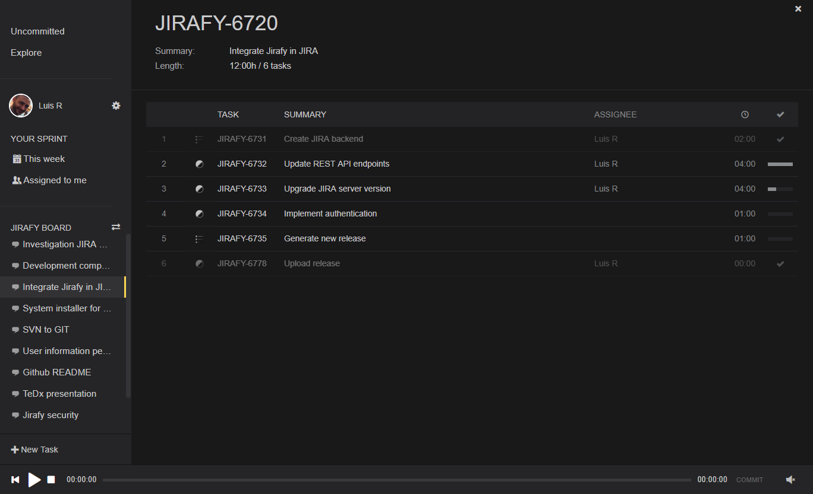
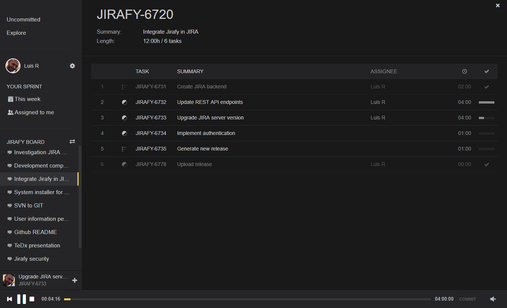
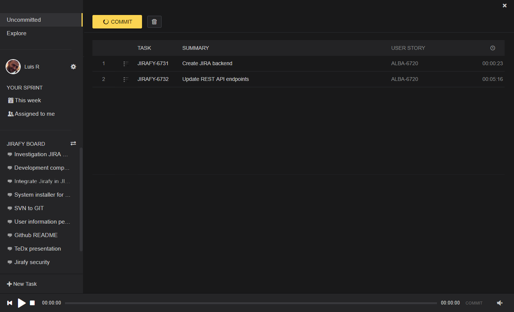

# Jirafy desktop
This application is the container of [Jirafy Viewer](https://github.com/lurume84/jirafy-viewer) project. It is a chrome-based application (CEF) that loads viewer seamlessly and provides local storage capabilities.

Jirafy is a time tracker for JIRA Agile that mimics Spotify's frontend. Songs are Tasks, Albums are User Stories, Artists are Assignees and music player is the Time Tracker. Work needs to be commited but tasks are automatically assigned to user when a task is started.

# Examples

# Motivation
Applications based on frontend-backend can transgress its expected lifetime. This is an experiment of a complete frontend reutilization thanks to HTML and REST APIs. A reinterpretation of Spotify concepts leads to a new application purpose.

## What it does

* Upgrades to last official Jirafy Viewer automatically
* Disables CORS to allow connection with Jira Servers
* Saves last authentication information

## What it will do

## Installation
Just go to Releases section and download last Jirafyetup.exe installer. It will create a shortcut to the installation folder %localappdata%/Jirafy Desktop.

## Usage
This application automatically creates folder %userprofile%/Documents/Jirafy.exe. This folder contains all user-related information that is described below

### CrashReports
In case application crashes, a dump will be generated inside this folder. If you want to contribute to its resolution send it to me.

### Download
Github releases will be downloaded here. To force a redownload of viewer just delete versions folder and open application again.

### Html
Contains the downloaded viewer. This is automatically stepped over by viewer updates, also contains your connection token. In case you want to remove credentials remove token.json file.

### Jirafy.ini
This is the file you need to modify to configure your desktop application.

## Development Guide
You need vs2017. Checkout and uncompress third_party.7z in the same folder.

## Compatibility
Windows is the only platform supported at this time. If application does not start up install last Visual Studio Redistributables.
